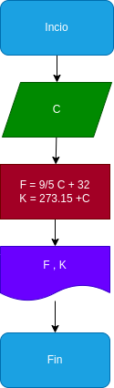

# Temperatura
programa de temperatura para realizar conversiones de temperatura
## calcular mediante grados celcius los grados fahrenheit y los grados kelvin

# analisis

variables de entrada

c: grados celcius o centigrados

variables de salida

f: grados fahrenheit
k: grados kelvin

# Diseño

# CONSTRUCCION

ejecicio n.2 hacer un programa que pase los grados celcius a grados kelvin y fahrenheit

F = (C + (9/5)+ 32)
K = C + 273.15

## ESTE ARCHIVO ESTA ESCRITO NE LENGUAJE MARKDOWN